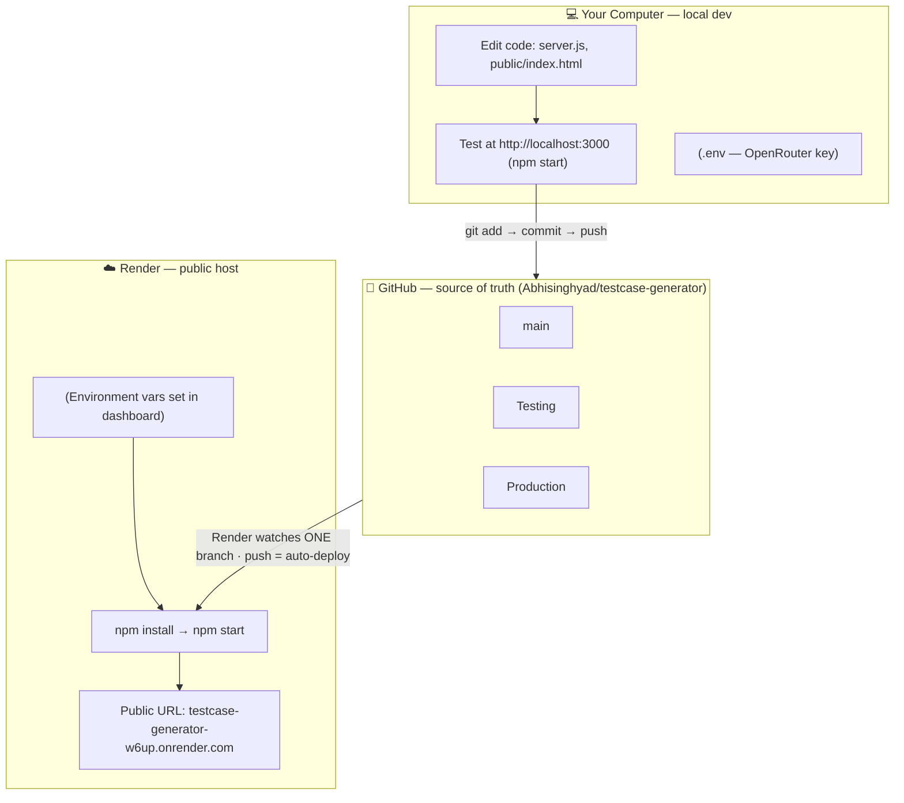
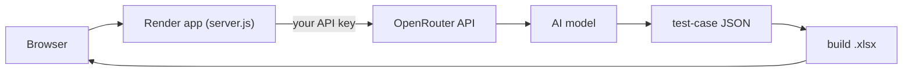

# Architecture &amp; Deployment

How the **Test Case Generator** travels from your laptop to a live public URL — and how to
control which branch is deployed.

---

## The three places your project lives

The same code exists in three environments; each has one job. Your `.env` (API key) is **never**
in GitHub — it only exists on your machine and in Render.



| # | Place | Job |
|---|-------|-----|
| 1 | **Your computer** | Edit `server.js` / `public/index.html`, test on `localhost:3000`. Secrets in `.env`. |
| 2 | **GitHub** | Stores the **code** and the branches (`main`, `Testing`, `Production`). **No `.env`** — it's git-ignored. |
| 3 | **Render** | Pulls the watched branch, runs `npm install` → `npm start`, injects env vars, serves the public URL. |

---

## Two flows, kept separate

Deploying code is a different path than a visitor using the app. Confusing the two is the usual
source of *"why isn't my change live"* vs *"why did generation error"*.

**Deploy flow** — how your code gets live:
```
edit code → git commit → git push → GitHub branch → Render builds → live URL updates
```

**Runtime flow** — what happens when someone uses the site:


> The AI is a **separate external service**. Your app just calls it with your key — which is why
> generation fails if `OPENROUTER_API_KEY` is missing or out of credit, even though the page loads.

---

## What the branches are for

Each branch is a parallel copy of the code. Render deploys exactly **one** of them. You promote
work forward by merging.

| Branch | Role |
|--------|------|
| `main` | Day-to-day working copy — where changes land first. |
| `Testing` | Staging — verify a change here before users see it. |
| `Production` | **Live** — only stable code. Point Render here so the public URL runs it. |

---

## Where the API key lives

Same app, key supplied differently per place. Never committed to git.

| Environment | Code comes from | API key comes from |
|-------------|-----------------|--------------------|
| Your computer | your project folder | `.env` file |
| GitHub | — | **not stored** (git-ignored) |
| Render | pulled from GitHub | **Environment** tab in the dashboard |

---

## Local development

```bash
npm install
# create .env from the template and add your key
cp .env.example .env      # then edit .env
npm start                 # → http://localhost:3000
```

Key `.env` values (see [`.env.example`](../.env.example)):

| Variable | Purpose | Example |
|----------|---------|---------|
| `OPENROUTER_API_KEY` | Provider key | `sk-or-v1-…` |
| `OPENROUTER_BASE_URL` | API base URL | `https://openrouter.ai/api/v1` |
| `OPENROUTER_MODEL` | Model slug | `openai/gpt-4o-mini` |
| `OPENROUTER_MAX_TOKENS` | Max output tokens | `4000` |
| `APP_PASSWORD` | Optional password gate (**set for public hosting**) | `a-strong-password` |
| `PORT` | Server port | `3000` |

---

## Deployment (Render)

The repo ships a [`render.yaml`](../render.yaml) blueprint and a [`Dockerfile`](../Dockerfile).

1. **dashboard.render.com** → **New +** → **Blueprint** → connect this repo (reads `render.yaml`).
2. In the service's **Environment** tab set the secrets:
   - `OPENROUTER_API_KEY` = your key
   - `APP_PASSWORD` = a password (**required for a public site** — otherwise anyone can spend your credits)
3. **Deploy** → you get a URL like `https://testcase-generator-w6up.onrender.com`.

> Render's **free** web service sleeps after ~15 min idle and takes ~30–60 s to wake on the next
> request (a brief "Not Found" flash during a cold start is normal — refresh). Upgrade for always-on.

### Change which branch Render deploys

1. Open **dashboard.render.com** → click the **testcase-generator** service.
2. Left sidebar → **Settings**.
3. Scroll to **Build &amp; Deploy** → find the **Branch** field (shows `main`).
4. Click **Edit** → choose `Production` (or `Testing`) → **Save Changes**.
5. Render deploys from that branch. If not, click **Manual Deploy → Deploy latest commit**.

From then on Render **watches that branch** — every push to it auto-deploys; pushes to the other
branches no longer affect the live site. The **Auto-Deploy** toggle is in the same section.

---

## A real example: ship a change safely

Make a change, verify on `Testing`, then promote to `Production` (which Render deploys).

```bash
# 1) make & verify on Testing
git checkout Testing
# ...edit code...
git add -A
git commit -m "tweak the prompt"
git push                       # pushes to Testing

# 2) promote Testing → Production
git checkout Production
git merge Testing
git push                       # Production now has the change

# 3) deploy
# If Render watches Production with Auto-Deploy ON, the push above already deployed.
# Otherwise: Render dashboard → Manual Deploy → Deploy latest commit
```

> **Golden rule:** keep `Production` = whatever is live. Never push experiments straight to it —
> go through `main` / `Testing` first, then merge.

---

_Stack: Node.js · Express · ExcelJS · OpenRouter (OpenAI-compatible)._
